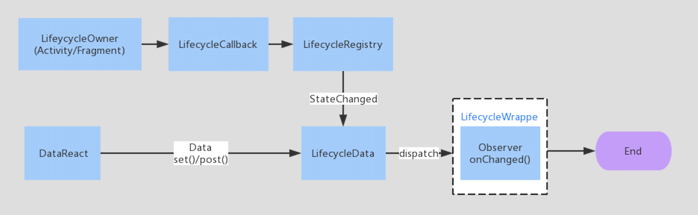

# Lotus

Lotus: a library for handling interaction between pages or modules in Android. 
Implemented based on Google Lifecycle-aware and the classic observer pattern.
<br/>


Features
-------------------

**Observers have life-cycle attributes**  Observers bind lifecycle owner(Activity/Fragment) with an API. Lifecycle-aware components perform actions in response to a change in the lifecycle status of another component, such as activities and fragments.

**Single Data pool** Lotus uses the single data pool for dispatching data and it can handle cross-module interaction perfectly. 

**Notify events more efficiently** Lotus only notify events to the observers which    subscribe the event.

**Support Mutex observer** The Data with a type(DataReactType) can hold one mutex observer.

**Support Annotation** Write the code with @DataSubscribe annotation to your subscriber methods. The performance can be improved greatly by indexing in build time than reflection in run time.

**Compatible without lifecycle** Lotus provides api for observes without lifecycle.


Getting started
-------------------

1. Define event type in DataReactType class:

```java
 public static final String LOGIN_SUCCESS = "type_1"
```
2. Declare subscribers:
 
```java
        @DataSubscribe(dataType ={DataReactType.LOGIN_SUCCESS})
        public void onLoginSuccess(Data data) { 
            //do something
            Log.e(TAG, "get data:" + data.getData());
        } 
```
3. Set data:

```java
  DataReact.set(new Data(DataReactType.LOGIN_SUCCESS).setData(userInfo));
```


License
-------------------

Copyright (C) 2018 iQIYI.com

Lotus binaries and source code can be used according to the [Apache License, Version 2.0](LICENSE).


